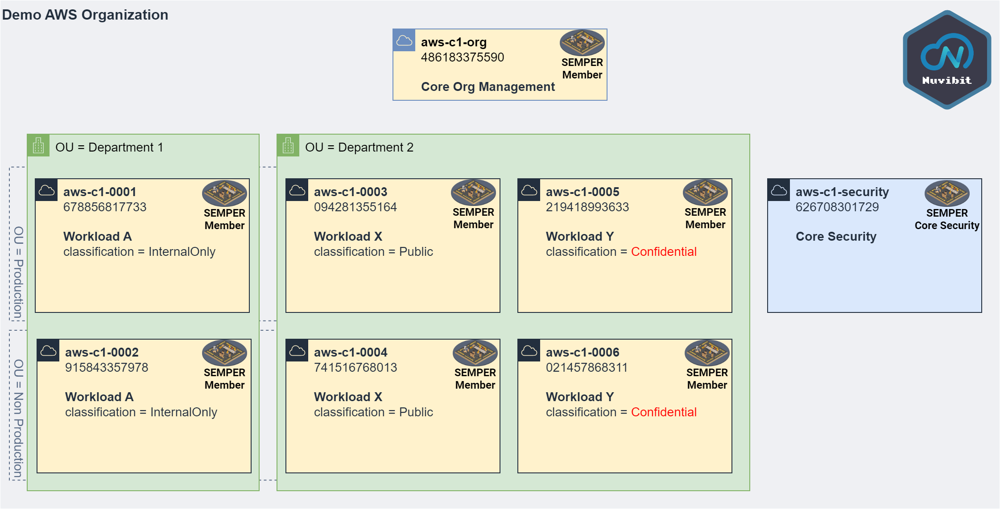
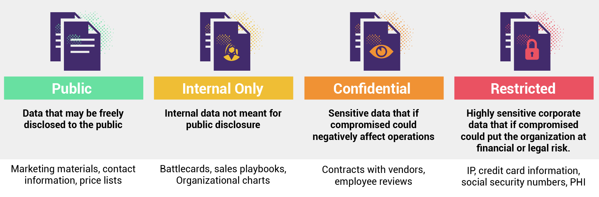

# ACAI SEMPER Demo 1 <a id="top">
- [Use-Case 1: Enable KMS CMK Rotation](#uc1)
- [Use-Case 2: IAM Role Governance](#uc2)
- [Use-Case 3: Security Group Governance](#uc3)


This SEMPER Demo is based on the following AWS Organization:



### Organization Unit Structure

> * Root (OU)
>   * CloudFoundation (OU)
>     * Department 1 (OU)
>       * Production (OU)
>         * **aws-c1-0001 (678856817733)**
>       * nonProduction (OU)
>         * **aws-c1-0002 (915843357978)**
>     * Department 2 (OU)
>       * Production (OU)
>         * **aws-c1-0003 (094281355164)**
>         * **aws-c1-0005 (219418993633)**
>       * nonProduction (OU)
>         * **aws-c1-0004 (741516768013)**
>         * **aws-c1-0006 (021457868311)**
>     * FoundationCore (OU)
>         * **aws-c1-security (626708301729)**
   
* Root OU: r-srnr
  * CloudFoundation OU: ou-srnr-yx5oa1br
    * Department1 OU: ou-srnr-ccyosamb
      * Production OU: ou-srnr-akdfxqfc
      * nonProduction OU: ou-srnr-n8w2r2yn
    * Department2 OU: ou-srnr-jsj5cqt7
      * Production OU: ou-srnr-b5c5s8r5
      * nonProduction OU: (ou-srnr-sfe3h852
    * FoundationCore OU:ou-srnr-k6qfelgi

## Use-Case 1: Enable KMS CMK Rotation <a id="uc1"></a> [🔝](#top)

> Security Control: **CIS AWS 1.5 - 3.8 Ensure rotation for customer created symmetric CMKs is enabled**

Requirement-Owner: Security/Compiance Team

Requirement: KMS CMK Rotation must be enabled in all accounts.

#### Solution

SEMPER [Configure-Policy](https://github.com/acai-consulting/semper-policy-repo-sample/wiki/10-SEMPER-Policies#policy_type_configure) for event detection: [/10_configure/event_rules/uc1x1_kms_cmk_rotation.json](./10_configure/event_rules/uc1x1_kms_cmk_rotation.json)

SEMPER [Extension-Policy](https://github.com/acai-consulting/semper-policy-repo-sample/wiki/10-SEMPER-Policies#policy_type_extension) for auto remediation: [/30_extension/uc1x1_ar_kms_cmk_enable_rotation.json](./30_extension/uc1x1_ar_kms_cmk_enable_rotation.json)


## Use-Case 2: IAM Role Governance <a id="uc2"></a> [🔝](#top)

> Security Control: **CIS AWS 1.5 - 4.4 Monitor for IAM policy changes**

### UC2.1: Monitor for IAM Role Changes

Requirement-Owner: Security/Compiance Team

Requirement: Monitor for IAM Role changes in the whole AWS Organization.

#### Solution

SEMPER [Configure-Policy](https://github.com/acai-consulting/semper-policy-repo-sample/wiki/10-SEMPER-Policies#policy_type_configure): [/10_configure/event_rules/uc2x1_iam_role_changes.json](./10_configure/event_rules/uc2x1_iam_role_changes.json)

#### Details
This policyScope-Section will provision the AWS Event Rule not to the SEMPER Default-Regions ("exclude": "*"), but to the us-east-1 region ("forceInclude": "us-east-1").

```json {linenos=table,hl_lines=[],linenostart=50}
{
  "configure": {
    "policyScope": {
      "regionScope": {
        "exclude": "*",
        "forceInclude": "us-east-1"
      }
    },
    ...
  }
}
```

### UC2.2: Boundary Policy for Critical IAM Roles in Department 2

Requirement-Owner: Security/Compiance Team

Requirement: For Department 2 IAM Roles of AWS Accounts, that are classified higher than 'Internal Only', must have an IAM Boundary Policy attached.



<sub><sup>From https://www.dasera.com/blog/data-classification-how-to-classify-your-companys-data-and-be-better-prepared-for-a-data-driven-future
</sub></sup>

#### Solution

SEMPER [Extension-Policy](https://github.com/acai-consulting/semper-policy-repo-sample/wiki/10-SEMPER-Policies#policy_type_extension): [/30_extension/uc2x2_ar_dpt2_critical_iam_role_permission_boundry.json](./30_extension/uc2x2_ar_dpt2_critical_iam_role_permission_boundry.json)

#### Details
This policyScope-Section will restrict the Extension-Policy to AWS Accounts in Department 2 that have a classification of 'Confidential' or 'Restricted':

```json {linenos=table,hl_lines=[],linenostart=50}
{
  "extension": {
    "policyScope": {
      "accountScope": {
        "exclude": "*",
        "forceInclude": {
          "accountTags": {
            "classification": [
              "Confidential",
              "Restricted"
            ]
          },
          "ouNameWithPath": [
            {
              "contains": "/Department2/"
            }            
          ]       
        }
      }
    },
    ...
  }
}
```

This section in the findingPattern will avoid a race-condition excluding events triggered by the userName = 'platform-security--auto-remediation--role'.

```json {linenos=table,hl_lines=[],linenostart=50}
{
  "extension": {
    ...
    "findingPattern": {
      "detail-type": "AWS API Call via CloudTrail",
      "detail": {
        "userIdentity": {
          "sessionContext": {
            "sessionIssuer": {
              "userName": [
                {
                  "exists": false
                },
                {
                  "exists": true,
                  "anything-but": "platform-security--auto-remediation--role"
                }
              ]
            }
          }
        },
        ...
      }
    },
    ...
  }
}
```

This extensionBlock will forward the SEMPER Finding to the stated SQS URL:

```json {linenos=table,hl_lines=[],linenostart=50}
{
  "extension": {
    ...
    "extensionBlock": {
      "sqsFanOut": [
        {
          "sqsUrl": "https://sqs.eu-central-1.amazonaws.com/626708301729/ar-attach-permission-boundary-policy-trigger"
        }
      ]
    }
  }
}
```

## Use-Case 3: Security Group Governance <a id="uc3"></a> [🔝](#top)

> Security Control: **CIS AWS 1.5 - 4.10 Monitor for Security Group changes**

### UC3.1: Monitor for Security Group changes in Production-Accounts

Requirement-Owner: Security/Compliance Team

Requirement: Monitor for Security Group changes in Production accounts only (Tailored CIS AWS 1.4 - 4.10).

#### Solution

SEMPER [Configure-Policy](https://github.com/acai-consulting/semper-policy-repo-sample/wiki/10-SEMPER-Policies#policy_type_configure): [/10_configure/event_rules/uc3x1_prod_cis_aws_1x4_4x10.json](./10_configure/event_rules/uc3x1_prod_cis_aws_1x4_4x10.json)

#### Details
This policyScope-Section will provision AWS Event Rules to the SEMPER Default-Regions, of AWS Accounts where the account-tag 'environment' has the value 'production'.

```json {linenos=table,hl_lines=[],linenostart=50}
{
  "configure": {
    "policyScope": {
      "accountScope": {
        "exclude": "*",
        "forceInclude": {
          "accountTags": {
            "environment": "production"
          }
        }
      }
    },
    ...
  }
}
```

### UC3.2: Exception for Security Group changes of Production Workload X

Requirement-Owner: Workload X Team

Requirement: Exception for inbound TCP port 80 / 443 Findings for Production Workload X. No monitoring is required.

#### Solution

SEMPER [Filter-Policy](https://github.com/acai-consulting/semper-policy-repo-sample/wiki/10-SEMPER-Policies#policy_type_filter): [/20_filtering/cloudtrail_api_calls/uc3x2_dpt2_wlx_sg_tcp80.json](./20_filtering/cloudtrail_api_calls/uc3x2_dpt2_wlx_sg_tcp80.json)

SEMPER [Filter-Policy](https://github.com/acai-consulting/semper-policy-repo-sample/wiki/10-SEMPER-Policies#policy_type_filter): [/20_filtering/cloudtrail_api_calls/uc3x2_dpt2_wlx_sg_tcp443.json](./20_filtering/cloudtrail_api_calls/uc3x2_dpt2_wlx_sg_tcp443.json)

#### Details
Due to this [UC3.1 Configure Policy](./10_configure/event_rules/uc3x1_cis_aws_1x4_4x10_prod.json) all Security Group Changes of Production Accounts will be detected by SEMPER Processing.

This policyScope-Section will isolate Security Findings where the account-tag 'title' has the value 'Workload X' and the ouNameWithPath of the account contains '/Department2/'. This Security Findings will be sent to the Post-Processing Dropped Security Findings SNS.

```json {linenos=table,hl_lines=[],linenostart=50}
{
  "filtering": {
    "policyScope": {
      "accountScope": {
        "exclude": "*",
        "forceInclude": {
          "accountTags": {
            "title": "Workload X"
          },
          "ouNameWithPath": [
            {
              "contains": "/Department2/"
            }            
          ]
        }
      }
    },
    ...
  }
}
```

### UC3.3: Alarm for Security Group Rule allowing SSH on Workload Y

Requirement-Owner: Security/Compiance Team

Requirement: TCP port 22 (SSH) for Department 2 Workload Y shall raise an instant alarm.

#### Solution

SEMPER [Extension-Policy](https://github.com/acai-consulting/semper-policy-repo-sample/wiki/10-SEMPER-Policies#policy_type_extension): [/30_extension/uc3x3_alarm_dpt2_wly_sg_tcp22.json](./30_extension/uc3x3_alarm_dpt2_wly_sg_tcp22.json)

#### Details
Due to this [UC3.1 Configure Policy](./10_configure/event_rules/uc3x1_cis_aws_1x4_4x10_prod.json) all Security Group Changes of Production Accounts will be detected by SEMPER Processing.

This policyScope-Section will isolate Security Findings where the account-tag 'title' has the value 'Workload Y' and the ouNameWithPath of the account contains '/Department2/'. In this case, the Security Finding will be sent to the SQS-FanOut processor.

```json {linenos=table,hl_lines=[],linenostart=50}
{
  "extension": {
    "policyScope": {
      "accountScope": {
        "exclude": "*",
        "forceInclude": {
          "accountTags": {
            "title": "Workload Y"
          },
          "ouNameWithPath": [
            {
              "contains": "/Department2/"
            }            
          ]       
        }
      }
    },
    ...
    "extensionBlock": {
      "sqsFanOut": [
        {
          "sqsUrl": "https://sqs.eu-central-1.amazonaws.com/626708301729/semper-processed-to-alarming-trigger",
          "delivery": "mail",
          "recipient": "${normalized.accountTags.account_owner}",
          "messageSubject": "SSH (TCP Port 22) was opened on Security Group in Department 2 - Workload Y - Production account."
        }
      ]
    }
  }
}
```

For further reference please see the wiki: https://github.com/acai-consulting/semper-policy-repo-sample/wiki

Copyright 2024 - ACAI GmbH Switzerland - https://acai.gmbh
